# Ejercicios-Flex
Ejercicios de Flex- Grupo 4 
Yeimy Beltran
Camilo Bernal
Yeisson Rincon

# Ejercicios-Flex — Grupo 4

Este repo es para el trabajo de Flex y Bison. Hicimos los primeros 5 ejemplos del libro "flex & bison" (O'Reilly) y acá documentamos qué hace cada uno, cómo funciona el código y qué resultados dieron las pruebas que corrimos.

## ¿Qué es flex?

Flex es una herramienta que genera un programa en C capaz de leer un texto y reconocer patrones dentro de él (por ejemplo, identificar números, palabras específicas o símbolos). Uno le escribe una lista de reglas, cada una con un patrón y una acción en C asociada, y flex se encarga de generar el código que revisa el texto de entrada y ejecuta la acción correspondiente cada vez que encuentra una coincidencia. A ese programa generado se le llama scanner o analizador léxico.

Bison hace el siguiente paso: toma los tokens que reconoce flex y verifica que se combinen según una gramática, para poder entender estructuras más complejas (como una operación matemática completa, no solo números y operadores sueltos).

## Cómo correrlo

Instalación:

```bash
sudo apt-get install flex bison
```

Ejemplos que son solo flex (1.1 al 1.4):

```bash
flex ejercicioX.l
cc lex.yy.c -lfl -o ejercicioX
./ejercicioX
```

Ejemplo 1.5, que junta flex con bison:

```bash
bison -d ejercicio1.5.y
flex ejercicio1.5.l
cc lex.yy.c ejercicio1.5.tab.c -lfl -o calculadora
./calculadora
```

---

## Ejemplo 1.1 — Contador de palabras (`ejemplo1.1.l`)

Es una versión simplificada del comando `wc` de Unix: cuenta líneas, palabras y caracteres de un texto.

**Cómo funciona:** tiene tres reglas. Si encuentra una secuencia de letras (`[a-zA-Z]+`), suma una palabra. Si encuentra un salto de línea (`\n`), suma una línea. Cualquier otro carácter (capturado por el punto `.`) se cuenta como carácter. Ninguna acción tiene `return`, así que el scanner no se detiene en cada coincidencia: sigue leyendo todo el archivo de corrido dentro de una sola llamada a `yylex()`, y recién al terminar el archivo se imprime el resultado final.

**Lo importante:** este ejemplo muestra la lógica más básica de flex, reglas que compiten por el texto de entrada, sin todavía pensar en tokens ni en un parser.

### Pruebas

- Entrada `hola` (sin salto de línea) → resultado `0 1 4`. Cuenta 0 líneas porque no hay `\n`; la última línea sin enter no se contabiliza.
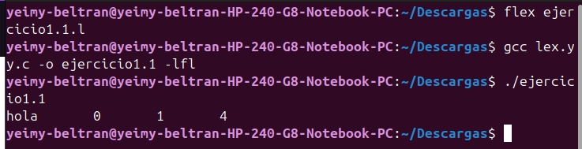

- Entrada `hola, mundo!` → cuenta 2 palabras; la coma y el signo se cuentan aparte como caracteres. El patrón de palabra se corta apenas encuentra un carácter que no es letra.
  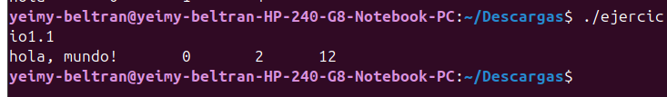
  
- Entrada `tengo 5 gatos` → el `5` no se cuenta como palabra, porque el patrón `[a-zA-Z]+` solo reconoce letras, no dígitos.
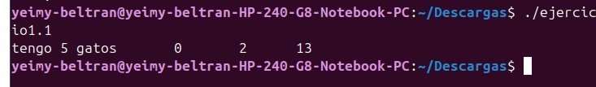

---

## Ejemplo 1.2 — Traductor de inglés a americano (`ejemplo1.2.l`)

Reemplaza palabras en inglés británico por su forma americana (`colour` → `color`, `flavour` → `flavor`, etc.). Todo lo que no está en la lista se deja igual.

**Cómo funciona:** cada palabra a traducir es una regla literal entre comillas. La última regla es un punto `.`, que actúa como comodín: si el texto no coincidió con ninguna palabra de arriba, se imprime tal cual usando `yytext` (la variable que guarda lo último que reconoció el scanner). Cuando dos reglas podrían aplicar al mismo texto, flex resuelve el empate primero por la coincidencia más larga, y si sigue habiendo empate, por la regla que aparece primero en el archivo — por eso las palabras completas le ganan siempre al punto suelto.

**Lo importante:** demuestra que flex puede usarse para transformaciones de texto simples sin necesidad de construir un parser completo.

### Pruebas

- Entrada `the colour is nice` → resultado `the color is nice`. Traducción básica.
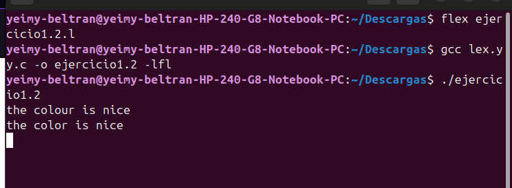

- Entrada `colourful` → resultado `colorful`. Como "colour" está contenido dentro de "colourful", igual se traduce, y el resto ("ful") queda intacto.
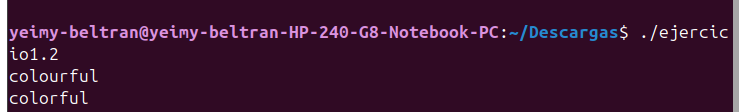

- Entrada sin ninguna palabra de la lista → sale exactamente igual. Confirma que la regla `.` deja pasar sin cambios todo lo que no reconoce.
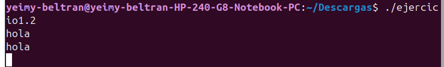

---

## Ejemplo 1.3 — Reconocimiento de tokens de la calculadora (`ejemplo1.3.l`)

Primer paso hacia la calculadora: identifica qué tipo de elemento es cada parte del texto (número, operador, etc.) sin realizar ningún cálculo todavía.

**Cómo funciona:** hay una regla por cada operador (`+ - * / |`), una para números (`[0-9]+`), una para el salto de línea, y los espacios/tabs se ignoran con una acción vacía. El comodín final avisa si aparece un carácter que no pertenece al lenguaje de la calculadora. Este archivo no define su propio `main()`: al enlazar con `-lfl` se usa el `main()` mínimo que trae la librería de flex, que solo llama a `yylex()`.

**Lo importante:** marca la diferencia entre reconocer texto (ejemplos 1.1 y 1.2) y clasificarlo en categorías (números, operadores), que es el paso previo a trabajar con tokens.

### Pruebas

- Entrada `12+34` → resultado `NUMBER 12`, `PLUS`, `NUMBER 34`, `NEWLINE`. Caso básico del libro.
  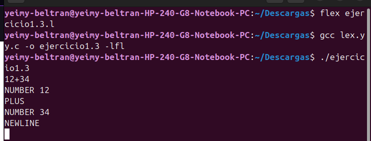
  
- Entrada `5 6 / 7q` → al final imprime `Mystery character q`. El scanner no se detiene ante algo que no reconoce, solo lo reporta y continúa.
  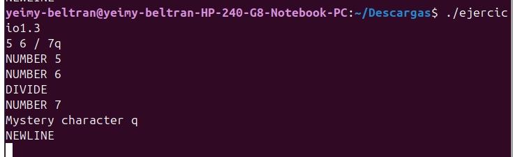
  
- Entrada `100000` → resultado `NUMBER 100000`. Confirma que `[0-9]+` no tiene límite de longitud, toma todos los dígitos seguidos.

  

---

## Ejemplo 1.4 — Tokens con valor (`ejemplo1.4.l`)

Evolución del ejemplo 1.3: cada token ahora tiene un número fijo asignado (por ejemplo, `NUMBER = 258`) y, cuando corresponde, un valor asociado guardado en la variable `yylval`.

**Cómo funciona:** es la forma en que se comunican un scanner y un parser: el parser no interpreta texto, interpreta números de token. Cuando el scanner ve "34" en el texto, lo convierte en el token `258` (NUMBER) y guarda `34` en `yylval`. Los números de token empiezan en 258 porque bison reserva los números del 0 al 257 (el 0 es fin de archivo, y los siguientes están destinados a representar caracteres individuales).

**Lo importante:** este ejemplo es el puente entre reconocer texto y prepararlo para que lo use un parser — ya no se imprime texto legible, se imprimen los códigos que bison va a interpretar.

### Pruebas

- Entrada `a / 34 + |45` → resultado `Mystery character a`, `262`, `258 = 34`, `259`, `263`, `258 = 45`, `264`. Caso exacto del libro, cada símbolo produce su número de token.
  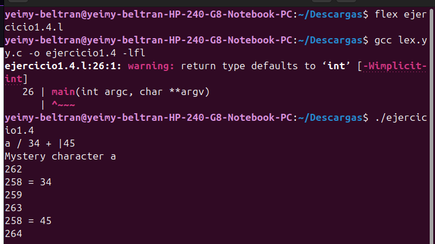
  
- Entrada `100 - 5` → resultado `258 = 100`, `260`, `258 = 5`, `264`. Confirma que `yylval` se actualiza correctamente en cada número, sin quedar con el valor anterior.
    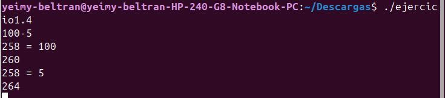
  
- Entrada `||5` → resultado dos tokens `263` (ABS) seguidos, luego `258 = 5`. El operador de valor absoluto puede repetirse, cada `|` genera su propio token.
  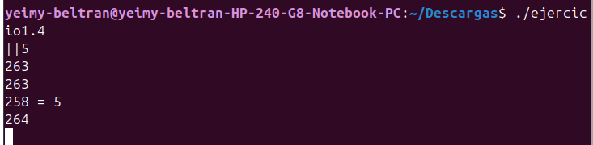

---

## Ejemplo 1.5 — Calculadora completa con bison (`ejemplo1.5.y`)

Combina flex y bison: el scanner reconoce los tokens y bison arma la operación matemática completa, respetando que multiplicación y división tienen prioridad sobre suma y resta.

**Cómo funciona:** la gramática está organizada en niveles, de menor a mayor precedencia:

```
calclist  →  una o más expresiones terminadas en salto de línea
exp       →  suma y resta (+, -)
factor    →  multiplicación y división (*, /)
term      →  un número, o un valor absoluto |numero|
```

Cada nivel se apoya en el anterior, por eso `2 + 3 * 4` da `14` y no `20`: la multiplicación se resuelve primero porque está en un nivel más profundo de la gramática (`factor`) antes de que actúe la suma (`exp`). Los símbolos `$$`, `$1`, `$2`, `$3` se refieren a las partes de cada regla en orden: `$$` es el resultado que se está construyendo, y `$1`, `$2`, `$3` son el primer, segundo y tercer elemento de la regla.

**Lo importante:** cierra el ciclo completo — flex identifica los elementos básicos del lenguaje y bison los combina según reglas que representan cómo se relacionan entre sí, el mismo principio que usan los compiladores reales.

### Pruebas

- Entrada `2+3*4` → resultado `= 14`. Confirma que la multiplicación se resuelve antes que la suma.
  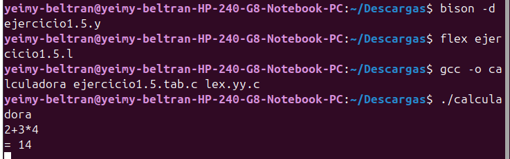
- Entrada `10-2-3` → resultado `= 5`. Las operaciones se resuelven de izquierda a derecha.
    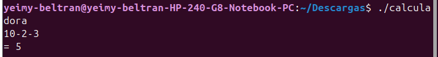
  
- Entrada `abc` → mensaje de error. La gramática rechaza entradas que no coinciden con ninguna regla, sin romper el programa.

---

## Errores que encontramos y cómo los arreglamos

**Ejemplo 1.5 — regla `calclist exp EOL`:**

En la regla que imprime el resultado, la acción original que veníamos escribiendo era:

```c
calclist: /* nothing */
    | calclist exp EOL { printf("= %d\n", $1); }
    ;
```

Esto compilaba, pero el resultado que imprimía no era el número calculado. El motivo es que en bison, `$1`, `$2`, `$3`... se cuentan según la posición de cada símbolo dentro de la regla. En `calclist exp EOL`, el símbolo 1 es `calclist` (que no tiene un valor numérico útil), el símbolo 2 es `exp` (que sí trae el resultado de la operación), y el símbolo 3 es `EOL`. Como estábamos imprimiendo `$1` en vez de `$2`, se estaba tomando el valor equivocado.

El arreglo fue cambiar `$1` por `$2`:

```c
calclist: /* nothing */
    | calclist exp EOL { printf("= %d\n", $2); }
    ;
```

Con ese cambio, el resultado impreso pasó a coincidir con el valor real de `exp`, y las pruebas (por ejemplo `2+3*4` dando `= 14`) empezaron a funcionar correctamente.

---

## Conclusión general

Los cinco ejemplos muestran una progresión clara:

1. **Reconocer texto** (1.1 y 1.2): solo flex, sin pensar todavía en tokens.
2. **Convertir texto en tokens** (1.3 y 1.4): se empieza a clasificar el texto en categorías (número, operador) en vez de tratarlo como texto suelto.
3. **Entender la estructura del lenguaje** (1.5): bison usa esos tokens para construir algo con sentido según una gramática.

Esta es la misma lógica que usa cualquier lenguaje de programación: un lexer (como flex) separa el código en piezas, y un parser (como bison) entiende cómo esas piezas se combinan.

